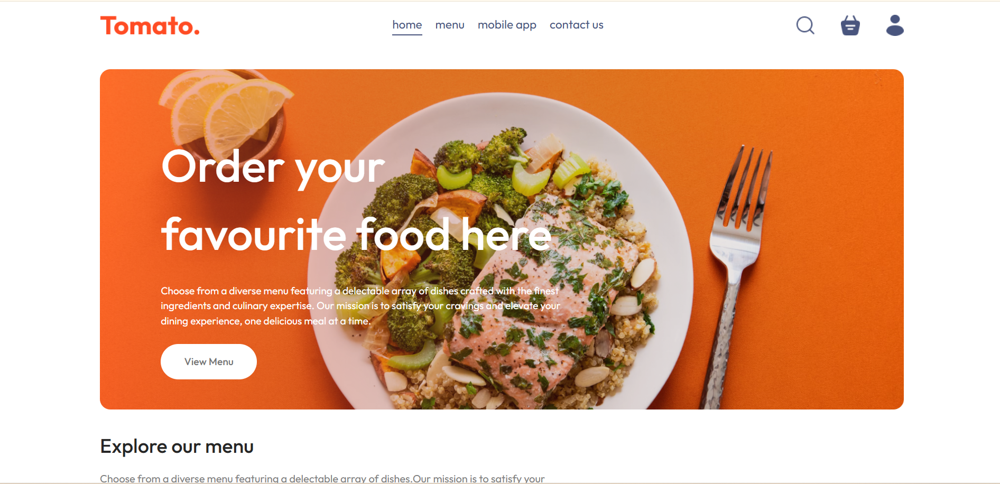
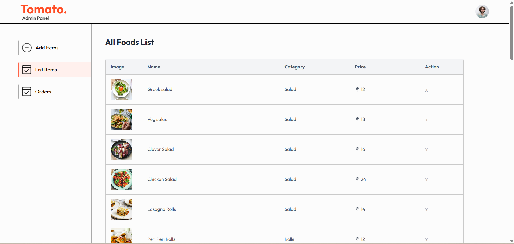

# Food Delivery Application

A full-stack food delivery web application built with the MERN stack, featuring user authentication, shopping cart functionality, payment processing, and an admin dashboard for managing food items and orders.

## 📸 Application Screenshots

### Frontend Interface


### Admin Panel


## 🌐 Live Demo

- **Frontend**: [https://food-del-channu-frontend.onrender.com/](https://food-del-channu-frontend.onrender.com/)
- **Admin Panel**: [https://food-del-channu-adminpanel.onrender.com/order](https://food-del-channu-adminpanel.onrender.com/order)

## 📋 Features

### User Features
- **Authentication**: Secure user signup and login using JWT tokens
- **Browse Menu**: View a diverse selection of 32+ food items across multiple categories
- **Shopping Cart**: Add items to cart with quantity adjustment using +/- controls
- **Payment Integration**: Complete purchases securely through Stripe payment gateway
- **Order Tracking**: View order history and track current orders
- **Responsive Design**: Seamless experience across all devices

### Admin Features
- **Item Management**: Add new food items to the menu with details and images
- **Inventory Control**: View and manage complete list of available food items
- **Order Management**: Monitor and process customer orders in real-time
- **Dashboard**: Centralized admin panel for all management operations

## 🍽️ Food Categories

The application offers a wide variety of food items organized into the following categories:

- **Salad** - Fresh and healthy salad options
- **Rolls** - Delicious wrapped rolls with various fillings
- **Deserts** - Sweet treats and ice cream varieties
- **Sandwich** - Classic and gourmet sandwich selections
- **Cake** - Freshly baked cakes for every occasion
- **Pure Veg** - Vegetarian specialties and dishes
- **Pasta** - Italian pasta dishes with various sauces
- **Noodles** - Asian-inspired noodle preparations

## 🛠️ Technology Stack

### Frontend
- **React.js** - UI library for building interactive interfaces
- **Context API** - Global state management for cart and user data
- **React Router DOM** - Client-side routing and navigation
- **Axios** - HTTP client for API requests
- **Tailwind CSS** - Modern styling and responsive design

### Backend
- **Node.js** - JavaScript runtime environment
- **Express.js** - Web application framework
- **MongoDB** - NoSQL database for data storage
- **JWT** - JSON Web Tokens for authentication and authorization
- **Stripe API** - Payment processing integration

## 🔐 Authentication & Authorization

- JWT-based authentication system for secure user sessions
- Token-based authorization for protected routes
- Separate authentication flows for users and admin
- Secure password handling and validation

## 💳 Payment Integration

- Integrated Stripe payment gateway for secure transactions
- Real-time payment processing
- Order confirmation after successful payment
- Support for multiple payment methods

## 🎯 Key Functionalities

### State Management with Context API
- Centralized cart management
- User authentication state
- Food items list management
- Token persistence with localStorage

### Cart Operations
- Add items to cart with + icon
- Increase/decrease item quantities
- Real-time cart total calculation
- Synchronized cart data with backend

### Order Flow
1. Browse food items by category
2. Add desired items to cart
3. Review cart and adjust quantities
4. Proceed to checkout
5. Complete payment via Stripe
6. View order confirmation and track orders

### Admin Operations
- Upload food items with images and details
- View comprehensive list of all food items
- Monitor incoming orders in real-time
- Manage order status and fulfillment

## 🔑 API Endpoints

### User Routes
- `POST /api/user/register` - User registration
- `POST /api/user/login` - User login

### Food Routes
- `POST /api/food/add` - Add new food item with image upload (Admin)
- `GET /api/food/list` - Get all food items
- `POST /api/food/removeFood` - Remove food item (Admin)

### Cart Routes
- `POST /api/cart/add` - Add item to cart (Protected)
- `POST /api/cart/remove` - Remove item from cart (Protected)
- `POST /api/cart/get` - Get user cart (Protected)

### Order Routes
- `POST /api/order/place` - Place new order (Protected)
- `POST /api/order/verify` - Verify payment and order
- `POST /api/order/userOrders` - Get user's order history (Protected)
- `GET /api/order/list` - Get all orders (Admin)
- `POST /api/order/status` - Update order status (Admin)

## 📱 Responsive Design

The application is fully responsive and works seamlessly across:
- Desktop computers
- Tablets
- Mobile devices

## 🔒 Security Features

- Password encryption
- JWT token authentication
- Protected API routes
- Secure payment processing
- Input validation and sanitization


## 📁 Project Structure

```
├── .vscode/        # VS Code configuration
├── admin/          # Admin panel application
├── backend/        # Server-side application
├── frontend/       # Client-side application
├── .gitignore      # Git ignore configuration
├── admin.png       # Admin panel screenshot
├── frontend.png    # Frontend screenshot
└── README.md       # Project documentation
```

## 🚀 Getting Started

Follow these steps to set up and run the application on your local machine.

### Prerequisites
- Node.js (v14 or higher)
- MongoDB database
- Stripe account for payment processing

## 💻 Installation

### 1. Clone the repository
```bash
git clone <repository-url>
cd FOOD_DEL
```

### 2. Install dependencies for all components

```bash
# Install backend dependencies
cd backend
npm install

# Install frontend dependencies
cd ../frontend
npm install

# Install admin panel dependencies
cd ../admin
npm install
```

### 3. Configure environment variables

Create `.env` file in the **backend** directory:
```env
MONGODB_URI=your_mongodb_connection_string
JWT_SECRET=your_jwt_secret_key
STRIPE_SECRET_KEY=your_stripe_secret_key
PORT=4000
```

Create `.env` file in the **frontend** directory:
```env
REACT_APP_API_URL=http://localhost:5173
REACT_APP_STRIPE_PUBLIC_KEY=your_stripe_public_key
```

Create `.env` file in the **admin** directory:
```env
REACT_APP_API_URL=http://localhost:5174
```

### 4. Run the application

```bash
# Run backend server (from backend directory)
cd backend
npm start
# Backend will run on http://localhost:4000

# Run frontend application (from frontend directory)
cd frontend
npm start
# Frontend will run on http://localhost:5173

# Run admin panel (from admin directory)
cd admin
npm start
# Admin panel will run on http://localhost:5174
```

## 📝 License

This project is open source and available for educational purposes.

## 👨‍💻 Developer

Built with passion for creating seamless food ordering experiences.

## 🤝 Contributing

Contributions, issues, and feature requests are welcome!

## 📞 Contact

For any queries or support, please reach out through the GitHub repository.

---

**Note**: Make sure to configure your environment variables properly before running the application. Keep your API keys and sensitive information secure. Never commit `.env` files to version control.